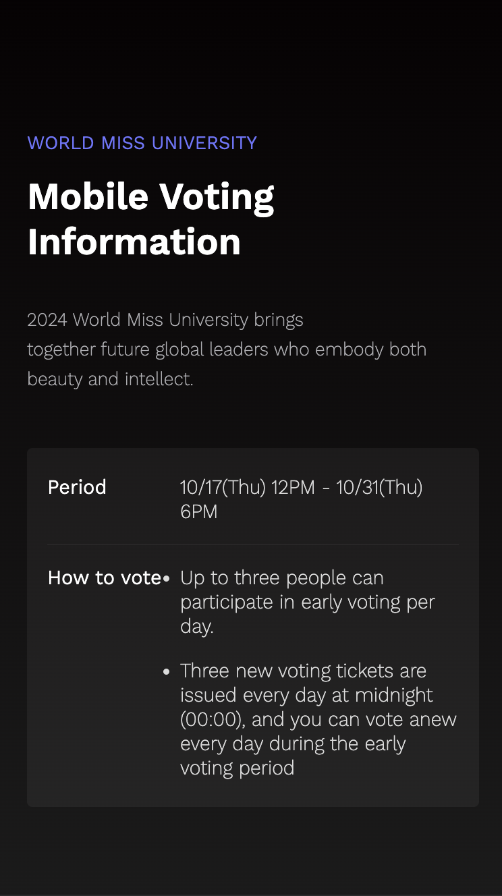
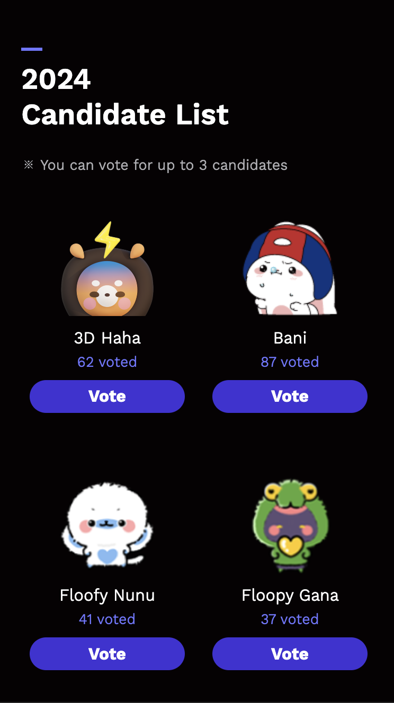
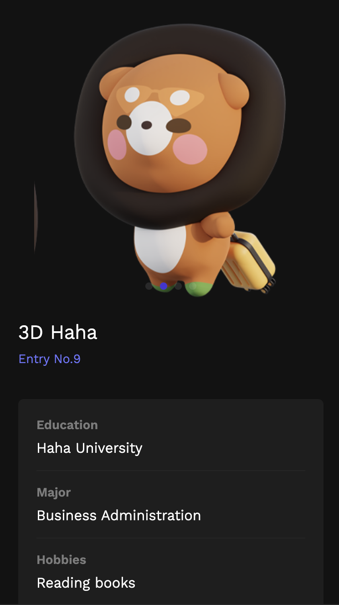
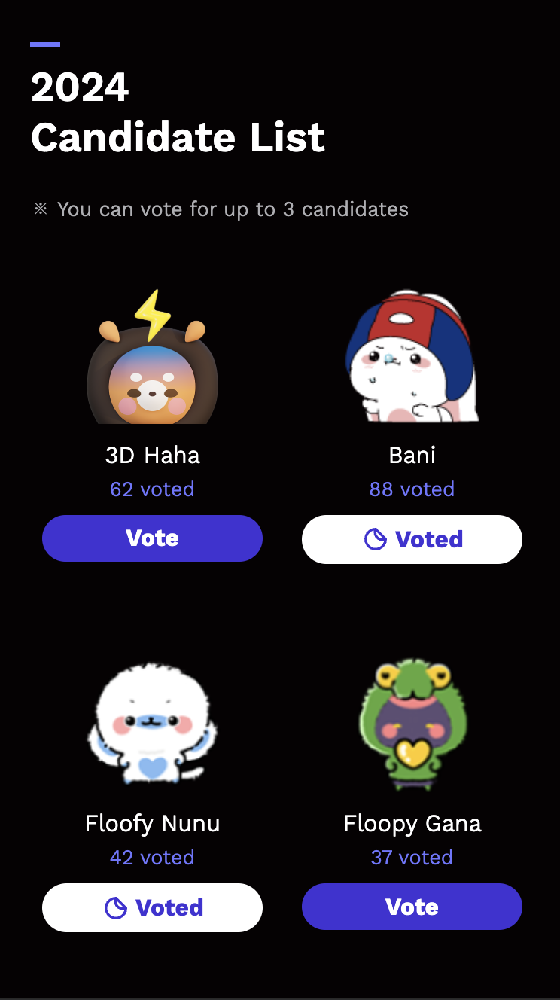

# 🗳️ AngkorLife

AngkorLife 인기 투표 참여자를 리스트업하고 각 참여자들의 상세 프로필을 확인하고 투표할 수 있는 서비스

## 📌 FRONTEND 요구사항

### 필수 기술 스택

- React, 함수형 컴포넌트 18버전 이상
- Typescript
- React-query

### 선택 기술 스택

- CSS module
- SCSS

## 🗂️ 폴더 구조

```markdown
public/
├── assets/
│ └── images/
src/
├── components/
├── pages/
├── styles/
│ ├── fonts.scss
│ ├── global.scss
│ └── variables.scss
├── hooks/
│
└── App.tsx
└── index.tsx
└── api.tsx
```

## 📸 Screen Shot

<table>
  <tr>
    <td></td>
    <td></td>
    <td></td>
    <td></td>
  </tr>
  <tr>
    <td></td>
    <td></td>
    <td></td>
    <td></td>
  </tr>
</table>
